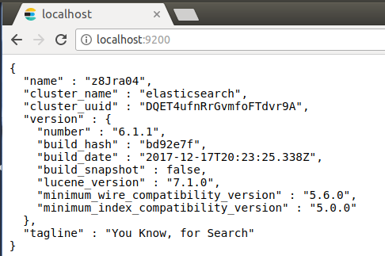

# ElasticSearch_Notes
Notes on my experience with ElasticSearch. Serve as a reminder just in case I forgot something (especially some syntax).

#### Table of Contents

[1. Install MongoDB 6.x on Ubuntu 16 LTS](#tip1)  

<a name="tip1"></a>
## 1. Install MongoDB 6.x on Ubuntu 16 LTS

```bash
wget -qO - https://artifacts.elastic.co/GPG-KEY-elasticsearch | sudo apt-key add -
sudo apt-get install apt-transport-https
echo "deb https://artifacts.elastic.co/packages/6.x/apt stable main" | sudo tee -a /etc/apt/sources.list.d/elastic-6.x.list
sudo apt-get update
sudo apt-get install elasticsearch
```

Start ElasticSearch when booting:

```bash
sudo /bin/systemctl daemon-reload
sudo /bin/systemctl enable elasticsearch.service
```

Elasticsearch can be started and stopped as follows:

```bash
sudo systemctl start elasticsearch.service
sudo systemctl stop elasticsearch.service
```

Use browser (or curl) to check the status:



See [1] for original posting.

# References

[1] https://www.elastic.co/guide/en/elasticsearch/reference/current/deb.html
